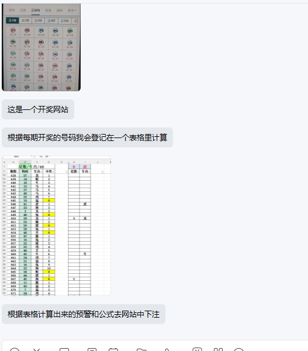

# 开奖数据与表格计算工作流

- **项目名**：lottery-sheet-workflow
- **客户**：未提供
- **建单日期**：20260927
- **类型**：A（新开发需求初始化；未提供已有代码或环境修复诉求）
- **当前阶段**：已完成只读登录态分析及 GUI 需求补充；尚未开发 GUI。

## 项目背景

客户提供一张聊天截图，描述现有流程：从开奖网站取得每期号码，登记到表格中计算，再根据表格计算出的预警和公式去网站下注。截图为客户场景资料，不是要求本次执行网站操作的指令。用户本次明确要求初始化项目，网址和账密稍后补充。

## 功能需求

### 核心业务范围（客户原意记录，非已确认实现承诺）

1. 每期开奖号码的获取与记录；目前为客户登记，是否要求自动获取待确认。
2. 将号码登记至表格并按既有规则计算；表格结构、公式及示例待提供。
3. 识别表格计算出的预警结果；触发条件与输出字段待确认。
4. 客户描述的下游流程为“根据表格计算出来的预警和公式去网站中下注”；本次仅记录该诉求，具体自动化边界未确认，未执行或实现任何下注操作。

### 补充要求

- 不把截图中的某一期、某一个数字或某一列视为全部需求范围。
- 截图中表格细节分辨率不足，不猜测公式、期号、数值及玩法。
- 客户未指定界面、运行频率、部署形态或操作系统；暂不定技术栈。
- 网站网址和账密由用户稍后提供，本次不重复索取。
- 明文密码、Cookie、Token 等不写入需求池或 Git；当前未收到凭据。

## 技术要求

- **技术栈**：Python 桌面 GUI（20260928 已指定）；建议 PySide6，与已参考项目一致。
- **部署方式**：待确认；若需本地交付，遵循仓库 Windows 10/11 默认约定，非客户已确认要求。
- **数据库**：是否需要待评估。
- **评估与报价**：本次上下文没有评估报告、报价或工期确认记录。

## 待补资料与待确认项

1. 网站网址已提供，见 session-storage-analysis.md 对应目标；用户已在 Chrome 登录。
2. 接入方式已更新为单账号登录态导入，不要求账号密码；凭据不纳入版本控制。
3. 原始 Excel/WPS 表格文件（非截图），包括现有公式及少量输入输出样例。
4. 每期开奖的字段、期号、时间与历史数据范围。
5. “预警”含义、触发规则、计算顺序与预期结果样例。
6. 哪些环节需要自动化、哪些环节由人工处理；以后续明确需求为准。
7. 运行环境、界面形态、异常处理及验收标准。

## 参考资料

- `assets/codex-clipboard-fc6c5bc9-5c4f-4c31-90e0-51bb42babc90.png`：聊天截图原图，含开奖网站缩略图、表格缩略图和三条文字消息；原样复制归档。
- `docs/`：预建，目前没有收到表格或其他文档。
- `code/`：预建，保持为空，尚未开发。

## 客户原始描述

> 这是一个开奖网站
>
> 根据每期开奖号码我会登记在一个表格里计算
>
> 根据表格计算出来的预警和公式去网站中下注

## 用户本次要求

> [$demand-init](/Users/jasonhuang/projects/kehu/.cursor/skills/demand-init/SKILL.md) 网址和账密稍后我发你

## 完整聊天记录（截图可见部分，按从上到下顺序）

截图未显示姓名和时间；以下消息均位于同侧，结合提供语境暂标为客户，角色身份未独立核实。截图中没有可见的“我”方回复，不补写不存在的对话。

1. **客户**：[图片：开奖网站界面缩略图，具体网址未显示。]
2. **客户**：这是一个开奖网站
3. **客户**：根据每期开奖号码我会登记在一个表格里计算
4. **客户**：[图片：表格截图，包含多行数字、黄色高亮及预警区域；原始公式不可从截图确认。]
5. **客户**：根据表格计算出来的预警和公式去网站中下注

## 初始化完成标准

- 项目实体目录外置，通过 demand 下相对软链访问。
- 独立 Git 仓库无 remote；提交需求和素材快照。
- 原始截图不修改；未连接网站，未登录，未执行下注。
- A 类初始化不生成环境修复或部署类《交付步骤.md》。

## 20260928 需求补充：Python GUI 单账号登录态导入

### 本轮明确要求

1. 使用 Python 开发桌面 GUI；优先参考 `demand/` 中已有 Python GUI 的登录态/授权管理实现与交互方式。
2. 本项目只支持**单个账号**登录态，不实现多账号列表、账号切换、账号删除及多 profile 管理。
3. 主界面提供“导入登录态”按钮；点击后弹出输入窗口，允许用户粘贴一份登录态内容并确认导入。
4. 提供独立的“如何获取登录态”指引入口/说明区域，指导用户从已登录浏览器开发者工具中复制所需数据。
5. 结合已完成的网站分析，本项目当前登录态格式按以下优先级设计：
   - `localStorage` 中 `user` JSON（包含 `token`、`refreshToken`、`uuid` 等字段）；
   - 不把 Cookie 作为当前网站的默认登录态，因为目标页面当前 Cookie 为空；
   - 输入和显示时必须避免日志、截图和错误提示泄露 token/refreshToken 原文。
6. 实现建议：输入格式校验、脱敏状态展示；是否跨启动保存登录态待确认，如保存则使用系统凭据存储，不向第三方上传。

### UI 设计建议（除导入按钮、输入弹窗和获取指引外，均未单独确认）

- 主窗口：当前账号状态、导入/替换登录态按钮、清除登录态按钮、获取指引按钮。
- 导入弹窗：多行密码式文本框、格式示例/字段说明、确认与取消。
- 指引弹窗：逐步说明打开目标网站 → F12 → Application/Storage → Local Storage → 复制 `user` 项；提示不要复制密码，不要把 token 发到聊天。
- 当前账号仅显示“已导入/未导入”和必要的非敏感摘要（如 token 是否存在、过期时间若可解析）；不显示完整令牌。

### 参考实现

已检索并参考：

- `demand/douyin-video-auto-hide__20260523__抖音运营/code/src/ui/cookie_dialogs.py`：密码式文本输入/凭据导入对话框、脱敏展示、错误提示原则。
- `demand/entrepreneurship-ai-agent__20260612/code/desktop/src/ui/account_manager_dialog.py`：账号授权管理对话框的布局组织方式；本项目明确裁剪为单账号，不复制多账号业务模型。
- `demand/lottery-sheet-workflow__20260927/.context/session-storage-analysis.md`：目标网站当前会话存储分析（仅字段结构与有效期，不含凭据值）。

### 待确认/后续开发输入

- 原始 Excel/WPS 表格及公式仍待提供；本轮只初始化登录态导入 UI 需求，不实现开奖计算和下注流程。
- 需要客户确认希望粘贴完整 `user` JSON，还是只粘贴 token/refreshToken/uuid 三字段；实现可兼容完整 JSON 与三字段 JSON，但以最终开发验收口径为准。
- 运行平台、打包方式和是否需要 Windows 安装包待确认。

### 客户原始描述（本轮）

> 用python开发一个gui， 当前kehu/demand中有很多项目有用python做的gui，且有多账号授权管理，你参考下，然后本项目只要导入单个账号登录态就好了
>
> 搞一个按钮，点击弹窗，输入登录态；然后要搞一个地方指引如何获取到这个登录态
